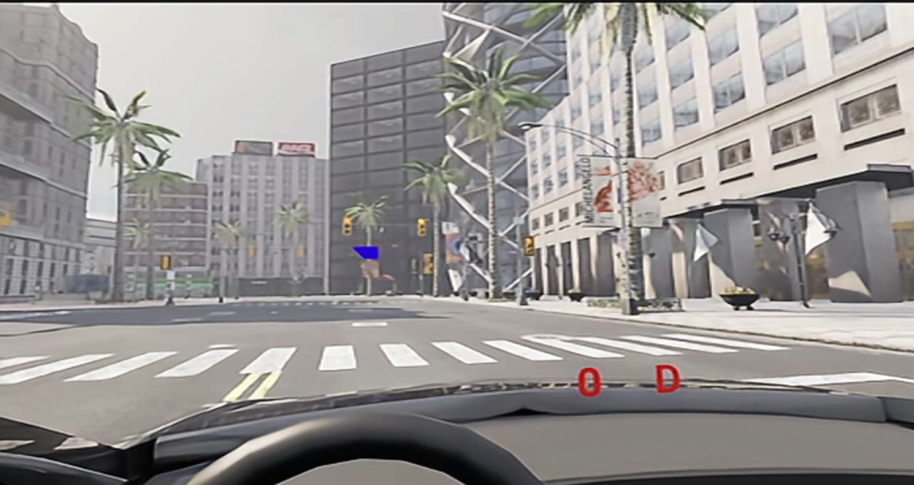
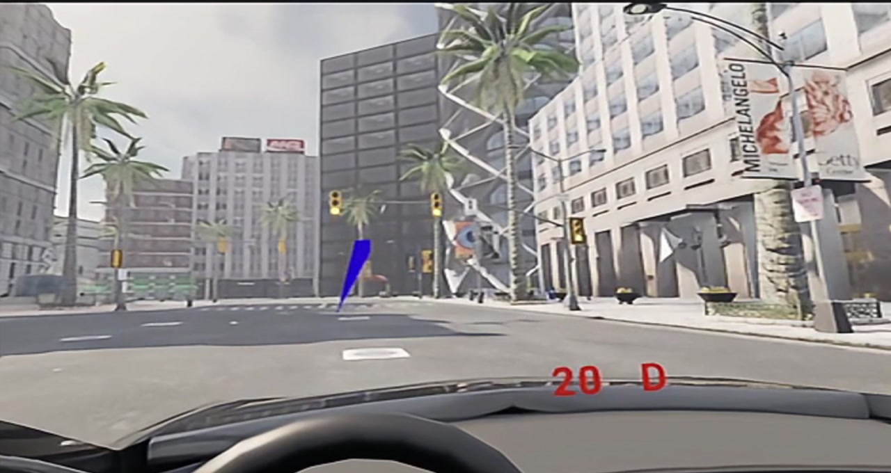
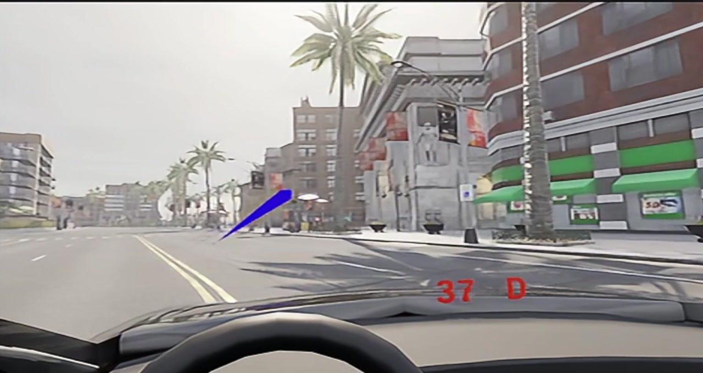
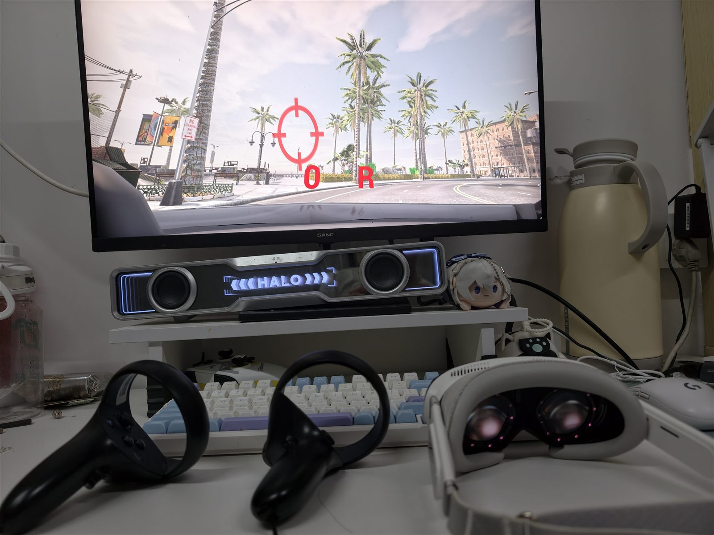
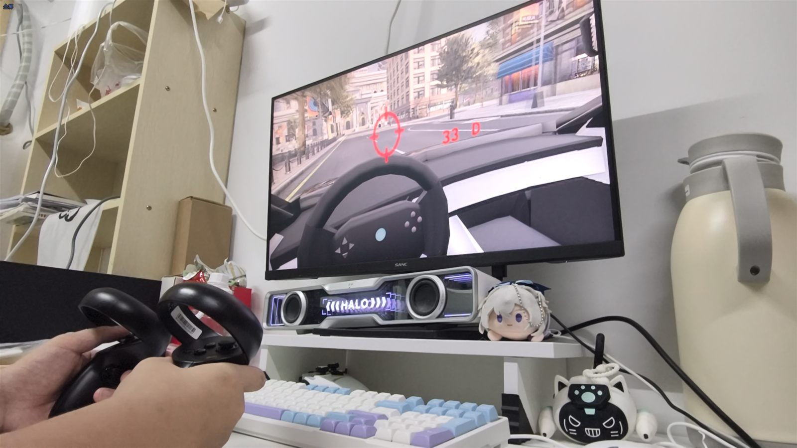

# Pimax Dream Air 驾驶与眼动追踪

本页介绍如何在 OpenHUTB（DReyeVR）中使用 Pimax Dream Air 系列头显和 Crystal 手柄，包括手柄驾驶、连续调整座椅、combined gaze 眼动追踪以及蓝色注视线显示。

手柄功能适用于 Pimax SteamVR 驱动识别为 `oculus_touch` 的设备；眼动追踪目前已在 **Pimax Dream Air + Windows + Pimax Play + SteamVR** 环境中完成实机验证。

对应代码改动：

- [Pimax 手柄驾驶与座椅连续移动 OpenHUTB/hutb#3665](https://github.com/OpenHUTB/hutb/pull/3665)
- [Pimax 眼动追踪与相机附着视线 OpenHUTB/hutb#3670](https://github.com/OpenHUTB/hutb/pull/3670)

## 功能状态

| 功能 | Dream Air 验证状态 |
| --- | --- |
| VR 显示与头部追踪 | ✓ |
| 左摇杆转向、扳机油门/刹车、A 键换挡 | ✓ |
| 右摇杆连续调整座椅前后/左右 | ✓ |
| 左右握把连续降低/升高座椅 | ✓ |
| combined gaze 眼动方向 | ✓ |
| 蓝色注视线、焦点检测、录制及 Python API 数据链 | ✓ |
| 单眼原点、瞳孔直径、眼睛开合度 | PVR 1.26 接口未提供 |

## 效果预览

静止注视：车辆停止时，蓝色视线随眼球移动并指向道路左前方目标。



行驶跟随：车辆行驶时，蓝色视线保持附着于头显相机。



注视转移：车辆继续行驶时，视线能够转向道路右侧目标，展示 combined gaze 的连续变化。



下面的视频为 Dream Air 实机内录。蓝色注视线的起点固定在头显前方，终点随眼球注视方向移动；车辆行驶时，视线会跟随相机，不会落在车辆后方。


设备图样：Pimax Dream Air 头显与 Crystal 手柄置于桌面，显示器同步输出旁观画面，红字 `0 R` 表示当前车速 0、倒挡。



手柄驾驶：显示器为座舱视角，方向盘随左摇杆实时转动，红字 `33 D` 表示车速读数 33、前进挡。



## 使用前准备

1. 安装并启动 Pimax Play，连接 Dream Air 和 Crystal 手柄。所需运行库随 Pimax Play 安装，无需手动复制 DLL；
2. 在 Pimax Play 中开启眼动追踪并完成眼动校准；
3. 从 Steam 安装 SteamVR，首次手动运行一次并确认头显和手柄正常连接；之后可由启动脚本自动拉起；
4. 使用包含 [OpenHUTB/hutb#3670](https://github.com/OpenHUTB/hutb/pull/3670) 的已编译版本；
5. 建议先关闭不需要的高开销功能，例如三个实时后视镜。

## 配置

在 `Unreal/CarlaUE4/Config/DReyeVRConfig.ini` 中确认以下配置：

```ini
[CameraParams]
SeatMoveSpeedCmPerSecond=75.0

[EgoSensor]
DrawDebugFocusTrace=True
UseCameraRelativeGazeDisplay=True

[Pimax]
EnablePvrEyeTracking=True
AllowUnknownPimaxDevice=False
AllowedVendorIds=0x34A4
AllowedProductIds=0x0012,0x0040,0x0042,0x0044
MaxSampleAgeSeconds=0.5
GazeInvertHorizontal=False
GazeInvertVertical=False
```

Dream Air 的产品 ID 为 `0x0044`。使用其他型号时，确认其 VID/PID 后再加入白名单。

## 启动方法

### 推荐：带检查的启动脚本

在**新版打包程序的根目录**打开 64 位 Windows PowerShell，执行：

```powershell
powershell -NoProfile -ExecutionPolicy Bypass -File .\StartPimaxVR.ps1
```

默认地图为 Town02。切换地图时添加 `-Map /Game/Carla/Maps/Town10HD_Opt`，所选地图须已安装或打包。

**源码开发版**需要先编译引擎和 `CarlaUE4Editor Win64 Development`，然后在源码根目录执行（引擎路径按实际位置修改）：

```powershell
powershell -NoProfile -ExecutionPolicy Bypass -File .\StartPimaxVR.ps1 -UE4Root 'H:\hutb-dev\UE4-hutb' -Map /Game/Carla/Maps/Town10HD_Opt
```

脚本检查 VR 配置、手柄绑定和运行库，自动启动 Pimax Play、SteamVR，再启动游戏。检查失败时，按提示修正后重试。

只检查、不启动任何程序时，在上述命令末尾添加 `-CheckOnly`。SteamVR 路径未登记时可指定 `-SteamVRRoot 'D:\steam\steamapps\common\SteamVR'`。

自行编译/打包时，先在 `CarlaUE4.uproject` 中启用 SteamVR 插件，再使用 `Util/BuildTools/Package.bat` 打包，携带启动脚本及所需配置。

### 手动启动与成功判据

已手动启动 Pimax Play 和 SteamVR 时，打包版的实际游戏命令为：

```powershell
.\CarlaUE4.exe /Game/Carla/Maps/Town02?game=/Script/CarlaUE4.DReyeVRGameMode -game -vr
```

戴上头显，确认显示和手柄正常，并在游戏日志中检查：

```text
Using Pimax PVR eye tracking
Pimax PVR: first valid eye sample
```

确认样本持续更新，蓝色视线随注视方向移动，车辆行驶时视线跟随相机。

## 自动测试（不需要连接头显）

需要 Windows 上已编译的引擎、项目 Editor 模块及项目资源，无需连接头显或安装 Pimax SDK。

在**源码根目录**执行：

```powershell
powershell -NoProfile -ExecutionPolicy Bypass -File .\Util\Tests\RunPimaxTests.ps1 -UE4Root 'H:\hutb-dev\UE4-hutb'
```

脚本运行以下 5 项测试：

| 测试名称 | 检查内容 |
| --- | --- |
| `HUTB.Pimax.EyeTracking.Freshness` | 眼动样本时间戳与新鲜度判断 |
| `HUTB.Pimax.GazeDisplay.CameraAttachment` | 调试视线附着于相机及更新依赖 |
| `HUTB.Pimax.GazeDisplay.FixedAnchor` | 视线起点固定、终点跟随注视方向 |
| `HUTB.Pimax.SeatInput.DeadZone` | 座椅输入死区与连续移动计算 |
| `HUTB.Pimax.Runtime.DiscoveryPaths` | 非 C 盘系统、自定义安装路径、去重及拒绝相对路径覆盖 |

报告保存在 `Unreal/CarlaUE4/Saved/Automation/Pimax-时间戳/`，也可用 `-ReportPath 'D:\HUTB-test\run-001'` 指定尚不存在的目录。输出 `PASS`、退出码为 0 表示全部通过；失败时查看报告中的 `automation.log` 和 `index.json`。

启动脚本另外提供 7 项轻量隔离测试，只需 Windows PowerShell 5.1，无需 UE4、Pimax Play 或 SteamVR：

```powershell
powershell -NoProfile -ExecutionPolicy Bypass -File .\Util\Tests\TestPimaxLauncher.ps1
```

该测试模拟启动过程，检查配置拦截、启动顺序及参数，不会实际启动软件。发布前还需连接头显验证 VR 画面、眼动、手柄操作及断连恢复。

## 手柄键位

| 功能 | 操作 |
| --- | --- |
| 转向（比例） | 左摇杆左右 |
| 油门（比例） | 右手扳机 |
| 刹车（比例） | 左手扳机 |
| 倒挡/前进挡切换 | A |
| 左转向灯 | X |
| 右转向灯 | B |
| 下一个摄像机视角 | Y |
| 上一个摄像机视角 | 右摇杆按下 |
| 自车/旁观视角切换 | 左摇杆按下 |
| 座椅升高 / 降低 | 右手柄握把 / 左手柄握把 |
| 座椅前后左右移动 | 右摇杆四向 |

## 常见问题

### 找不到 Pimax Play、运行库或 SteamVR

先确认 Pimax Play 和 SteamVR 已安装。自定义安装目录时，在启动命令末尾添加对应参数（路径按实际位置修改）：

```powershell
-PimaxRoot 'E:\VR\Pimax'
-PvrDllPath 'E:\VR\Pimax\Runtime\libPVRClient64.dll'
-SteamVRRoot 'D:\steam\steamapps\common\SteamVR'
```

DLL 路径须为 Pimax Play 所安装文件的本地绝对路径。

### 能识别设备，但没有眼动数据

如果日志持续出现 `timestamp-zero`，或者没有 `first valid eye sample`：

1. 退出模拟器；
2. 在 Pimax Play 中确认眼动追踪开关已开启；
3. 重新运行一次眼动校准；
4. 若仍无数据，重启 Pimax Play 或 Pimax 眼动运行时；
5. 确认眼动数据恢复后再启动模拟器。

### 有眼动数据，但看不到蓝色视线

确认 `DrawDebugFocusTrace=True` 和 `UseCameraRelativeGazeDisplay=True`，修改配置后重新启动模拟器。还应检查样本是否因时间戳停止更新而被判定为过期。

### 视线方向左右或上下相反

完成眼动校准后再测试。如坐标方向仍然相反，可分别调整：

```ini
GazeInvertHorizontal=True
GazeInvertVertical=True
```

只修改实际相反的轴。

### 右摇杆无法连续调整座椅

确认 SteamVR 使用当前应用的 Pimax/`oculus_touch` 绑定，并检查右摇杆是否绑定到标准 `vector2 position` action。

### 注视后视镜时严重掉帧

DReyeVR 的三个后视镜会额外渲染场景，VR 中开销较高。测试眼动追踪时可在车辆配置中暂时关闭：

```ini
RearMirrorEnabled=False
LeftMirrorEnabled=False
RightMirrorEnabled=False
```

## 已知限制

- 眼动后端目前只在 Windows 和 Pimax Dream Air 上完成实机验证；
- PVR 1.26 当前只提供 combined gaze 和设备时间戳，单眼原点、瞳孔直径和眼睛开合度保持无效状态；
- Pimax Runtime 更新 ABI 或安装位置后，可能需要同步更新后端；
- SRanipal 和 Pimax 眼动后端同时开启时，DReyeVR 优先使用 SRanipal；
