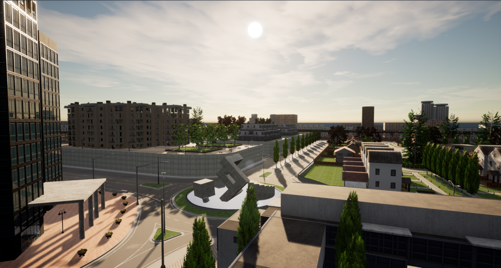
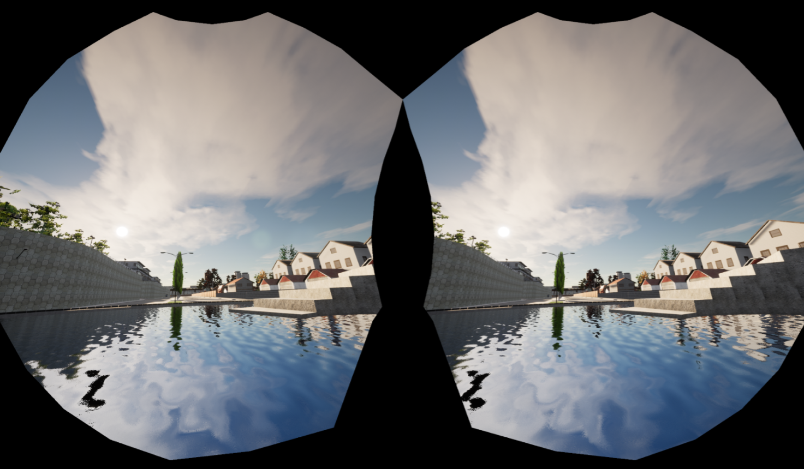
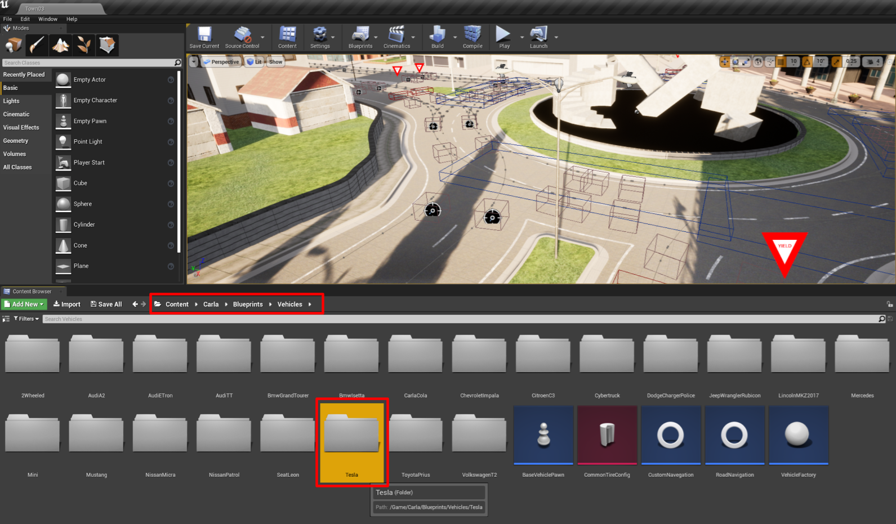
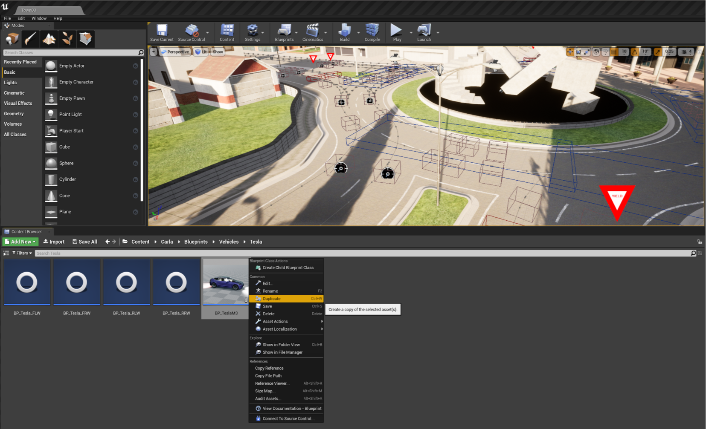
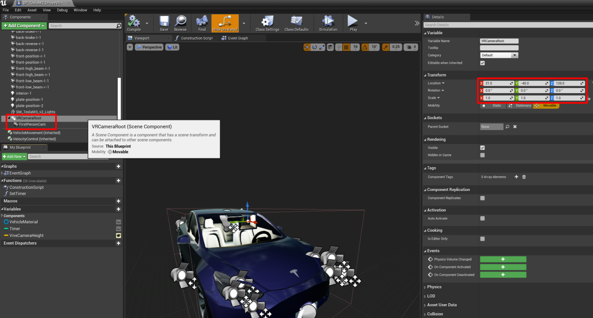
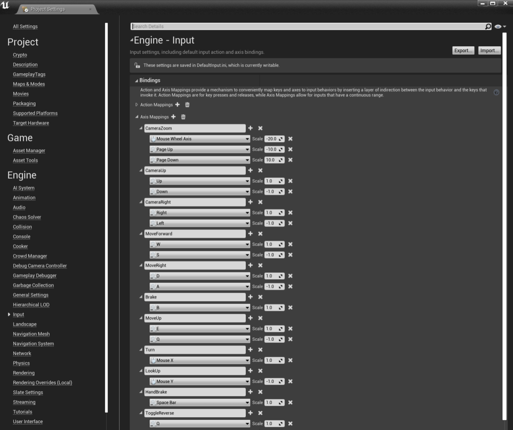
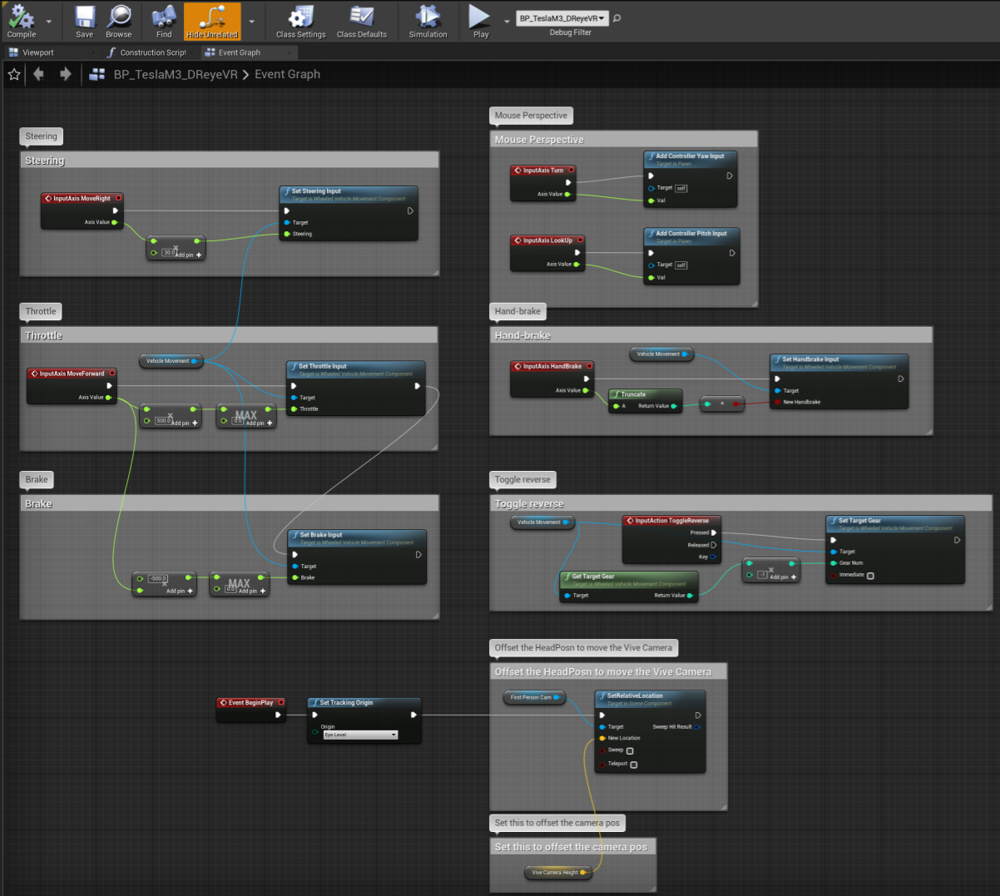
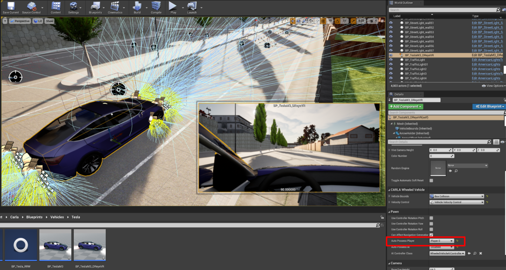
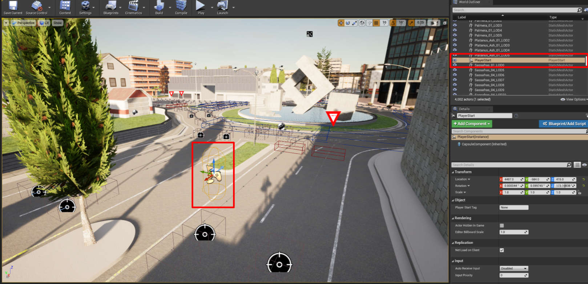

# 配置可驾驶的 VR 玩家

### 先决条件

我们需要安装并确保 **VR 模式**功能完备，请参阅 [VR-mode.md](VR-mode.md)。

默认的客户端-服务器（模拟器）会将你以“观察者(Spectator)”身份生成。这意味着你默认处于“穿墙”（no-clip）模式，可通过 `WASD` 键和`鼠标`进行控制。

#### 默认的穿墙观察者模式

此外，当以 `-vr` 模式运行此服务器时，我们会出生在默认的中心位置，且没有动作控制，仅支持摄像机移动：

#### 默认的 VR 观察者模式

如果仅使用外部客户端，这样做是可以的。然而，由于我们需要一个支持 VR 控制的玩家角色，且服务器端（UE4）也支持 VR，因此我们需要在服务器内生成该玩家角色。

## 在模拟器中创建自定义玩家
首先，若要在 Carla 模拟器的 VR 实例中创建一辆可驾驶的车辆，我们需要选择一款车辆模型。

### I. 查找车辆模型
Carla 在 `Content/Carla/Blueprints/Vehicles` 路径下提供了多种载具参与者的蓝图。本教程以 **Tesla Model 3** 为例，但该方法同样适用于其他任何车辆蓝图。

### II. 创建新的载具蓝图
最简单的方法是复制您想要使用的现有载具蓝图并重命名。在本指南中，我们将该车辆重命名为 `BP_TeslaM3_DReyeVR`。

### III. 添加第一人称摄像机与 VR 根节点

首先，我们需要双击上一节中创建的 `BP_TeslaM3_DReyeVR` 文件，这将打开一个新的蓝图窗口（如下图所示）。默认情况下，窗口会以“事件图表”（Event Graph）视图打开，但我们目前需要在“视口”（Viewport）区域进行操作。

1. 首先，我们需要点击绿色的“+Add Component”（添加组件）按钮，添加一个附加在主骨架网格体组件（作为其子组件）上的 Scene 组件。

   1. 你可以随意为该组件命名；为了清晰起见，我们将其命名为`"VRCameraRoot"`。后续我们无需引用此组件。

2. 在这里，你可以将这个 `VRCameraRoot` 组件拖放到车辆模型周围。由于我们需要将其放置在驾驶员座椅的位置，因此将其相对于车辆的坐标设为 `X:21.0, Y:-40, Z:120`。 

3. 接下来，我们需要创建一个摄像机组件并将其附加到 `VRCameraRoot` 上。你可以随意为该组件命名，但请注意，后续步骤中需要引用它。我们将它命名为`"FirstPersonCam"`。 

   1. 请注意，将此组件附加到 `VRCameraRoot` 后，摄像机会继承其位置，因此无需更改摄像机的 Transform（保持 {0, 0, 0} 即可）。 

   2. 此外，若要将摄像机的相对位置锁定在载具上（而非世界坐标系），务必确保**未勾选**`Camera Options > Use Pawn Control Rotation`。此设置会暂时禁用鼠标控制，但这完全符合我们的 VR 需求。

      1. 如果勾选此选项，鼠标将能够控制 VR 模式和 2D 模式下的摄像机位置。不过，在 VR 模式下，驾驶车辆向任意方向移动时，摄像机视角并不会随之同步转动；这意味着你需要转动现实生活中的头部来配合车辆的转向，这种体验并不理想。
   

### IV. 向场景中添加控制输入

既然已将摄像机附加到 Actor（角色/对象）上，我们需要一种方式，以便在模拟器的 VR（或非 VR）模式下控制该载具。

返回主编辑器窗口，点击“设置”（Settings）>“项目设置”（Project Settings），即可打开“项目设置（Project Settings）”窗口，在此处我们可以添加自定义输入事件。

在左侧导航栏中，进入“输入”（Input）>“绑定”（Bindings），界面应如下图所示。随后，你可以添加类似于我们示例的轴映射（Axis Mappings），从而将键盘和鼠标输入引入场景中。

对于我们简单的载具控制，我们将使用以下按键绑定：

- `W` : 油门/加速
- `A` : 左转
- `S` 或 `B` : 刹车
- `D` : 右转
- `Q` : 切换倒档
- `Space` : 保持手刹状态

!!! 注意
    某些控件具有负缩放比例。

例如，如果将`Mouse Y`设置为 +1，会导致鼠标视角控制反转。

### V. 在事件图表中编写控制方案

为了让 UE4 能够接收并实际使用这些输入，我们需要明确哪些输入对应哪些操作。这可以通过蓝图窗口中的“事件图表”（Event Graph）来实现。

请注意，若要创建节点（block），只需在窗口中右键点击并搜索相应的节点即可。按照控制方案中关键机制的顺序，具体步骤如下：

1. **鼠标视角** - 为了实现正确的鼠标移动效果，我们需要将“转向（Turn）”输入（鼠标 X 轴）用于 `ControllerYawInput`，并将“上下查看（Lookup）”输入（鼠标 Y 轴）用于 `ControllerPitchInput`。 

2. **VR 视角** - 我们需要使用“眼平模式（Eye Level）”（坐姿）下头显的“追踪原点”（Tracking Origin）作为触发 `SetRelativeLocation` 的依据。该原点已锁定至前文提到的 `FirstPersonCam`（见第三部分），并可通过“摄像机高度（Camera Height）”向量进行偏移（在本例中，该向量为 {0, 0, 0}，因此无需偏移）。

3. **转向** - 我们可以利用 `MoveRight` 来处理这一操作：将其数值放大 30 倍后传入 `SetSteeringInput`。由于 `A` 键对应负值，因此按 A 键会向左转向，而按 `D` 键则向右转向。 

4. **油门** - 我们首先将 `MoveForward` 的输出放大 500 倍，并将其限制在 [0, +∞) 范围内，从而仅利用 `W` 键实现向前加速。 

5. **刹车** - 我们将采用 `MoveForward` 的同一输出，将其缩放为 -500（即反向），并将其限制在 [0, +∞) 范围内，以此作为制动值 `S`。 

6. **切换倒挡** - 对于“切换倒挡”（ToggleReverse）功能，我们应使用“输入动作”（InputAction）而非“输入轴”（InputAxis）；具体做法是，当触发按下动作时，调用 `SetTargetGear` 函数，从而在正常挡位与倒挡之间进行切换。

7. **（可选）手刹** - 我们可以直接获取“手刹”（HandBrake）输入（空格键），并将其传递给 `SetHandbrakeInput` 函数。这并非必要，仅为示例，因为我们已经有了刹车机制。

最终，您的事件图应该类似于这样：

### VI. 将参与者放置到场景中并使用它

至此，该 Actor 应已制作完成并可驾驶；最后一步是将我们新建的 `BP_TeslaM3_DReyeVR` 蓝图放入场景中。只需将该蓝图拖放到地图上即可完成此操作。

将 Actor 放置到场景中并选中它后，你应该能看到摄像机视角——该视角应位于驾驶座位置！

接下来，进入右侧的“细节”（Details）面板，搜索“Auto Possess Player”（自动占有玩家）。将其设置从“Disabled”（禁用）更改为“Player 0”（玩家 0），这样观察者（Spectator）就能按预期直接生成在驾驶座上。

参考截图：

!!! 重要
    **移除旧的出生点**：最后一步是移除地图中现有的 `SpawnPlayer` 组件。例如，在默认的 `Town03` 地图中，Carla 默认将玩家放置在此处。

- 删除该出生点后，服务器将默认把玩家放置在 `BP_TeslaM3_DReyeVR` 蓝图中。

至此，你应该已经在 VR 驾驶模拟器中拥有了一个功能完备的玩家/观察者角色！

## 参考

* [Configuring a drivable VR player](https://github.com/GustavoSilvera/VR-Carla-Docs/blob/main/VRPlayer.md)