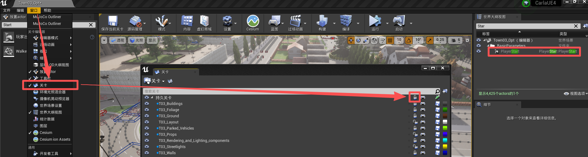

# 玩家出生点

## 变换

| 地图                                        | 位置                                                                                                                                 | 旋转 | 缩放 |
|-------------------------------------------|------------------------------------------------------------------------------------------------------------------------------------|-----|-----|
| Town01(_Opt)     | (12627.058594, 21210.371094, 1785.397217)    | (0.000046 °, -4.199958 °, -126.805 °)  | (1.0, 1.0, 1.0) |
| Town02(_Opt)     | (15028.0, 20436.0, 991.0)    | (-58.530861 °, 59.830147 °, -139.502045 °)  | (1.0, 1.0, 1.0) |
| Town03(_Opt)     | (-2853.0, 2256.0, 1235.0)    | (0.000044 °, 0.599745 °, -26.801725 °)  | (1.0, 1.0, 1.0) |
| Town04(_Opt)     | (24494.851562, -20514.84375, 1620.095581)    | (0.000009 °, 0.599718 °, 1.000204 °)  | (1.0, 1.0, 1.0) |
| Town05(_Opt)     | (4770.0, -2650.0, 1582.000732)    | (0.0 °, 0.0 °, -170.000183 °)  | (1.0, 1.0, 1.0) |
| Town06(_Opt)     | (3510.0, 17000.0, 1714.000732)    | (0.0 °, 0.0 °, -110.000153 °)  | (1.0, 1.0, 1.0) |
| Town07(_Opt)     | (-2069.594727, -13370.567383, 1296.563965)    | (0.0 °, 0.0 °, 90.000076 °)  | (1.0, 1.0, 1.0) |
| Town10(_Opt)     | (3620.341797, -754.089844, 4983.805176)    | (0.0 °, 0.0 °, 0.0 °)  | (1.0, 1.0, 1.0) |
| Town12     | (0.0, 0.0, 200.0)    | (0.0 °, 0.0 °, 0.0 °)  | (1.0, 1.0, 1.0) |

如果在分层地图的 PlayStart 为灰色（世界大纲视图），或者新建一个 玩家出生点（PlayStart），提示“因为关卡被锁定，所以请求的操作不能完成”，则应该在窗口/关卡中找到对应的关卡，将锁定的按钮解开：

