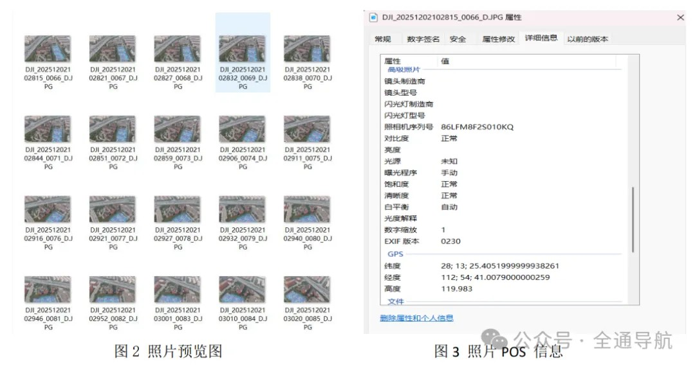
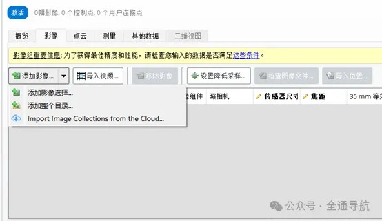
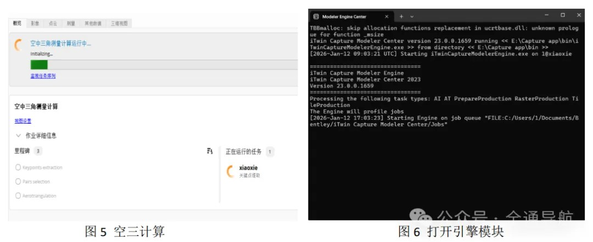
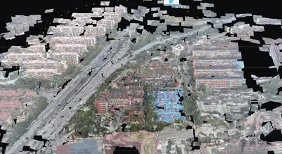
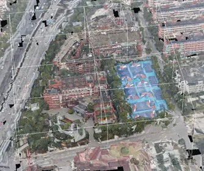
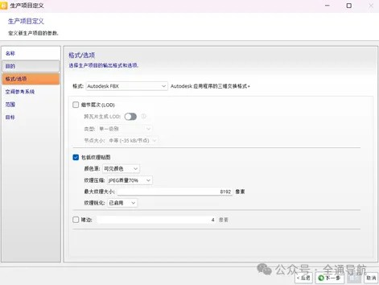
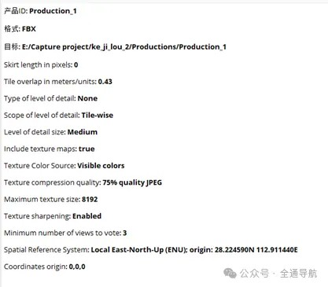
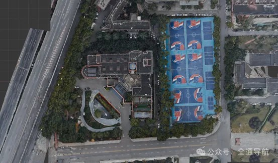
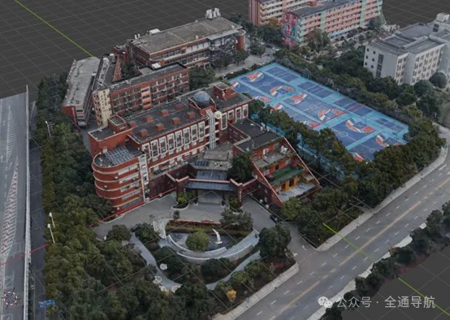

# 基于ContextCapture的无人机倾斜摄影三维建模操作流程 —— 湖工商科技楼为例

**软件环境**：Windows 11 + NVIDIA RTX 1060 + ContextCapture 2023.06（Master + Engine + Viewer）

## 一、实验环境配置

| 组件     | 版本/说明   | 
|----------|------------|
|无人机           | Air 3S 无人机 RTK  |
|三组航高           | 50/90/120 米  |
|航向/旁向重叠度     | 80%/70%  |
|Windows 11 23H2  | 	消息生成 | 
|GPU           | NVIDIA GeForce RTX 1060 Laptop GPU  | 
|驱动版本           | 581.57  |
|运行内存           | 16G  |
|重建软件           | ContextCapture 2023.06  |

💡 建议配置

✅ 电脑运行内存至少16G以上，否则容易生产失败

✅ C/D硬盘空间需留30G以上；无人机硬盘留10G以上

✅ 无人机支持航线规划 & RTK功能 → 提高照片利用率 & 定位精度

## 二、无人机倾斜摄影
### 1. 航摄实施要点

* 按时调机、设备调试及试飞 — 试照调整航摄元素

* 定期检查飞机及航摄设备，保障数据采集稳定

### 2.飞行参数设计值（下表）

| 技术参数     | 相对航高   | 旁向重叠度      | 航向重叠度  | 照片数 |
|-------------------------|--------|----------|----------------------------------------------------|----------|
| 设计值           | 120m  | 70%      | 80%   | 69张 |
| 设计值           | 90m  | 70%      | 80%   | 48张 |
| 设计值           | 50m  | 70%      | 80%   | 52张 |

!!! 注意
   建议1：手动飞行时建议重叠度＞70%；

   建议2：可使用航线规划软件自动飞行，保证重叠度稳定。

## 三、ContextCapture软件重建算法

### 1.SIFT算法（Scale Invariant Feature Transform）

1）建立尺度空间

2）GOG空间极值检测

3）特征点精准定位

4）计算特征点的主方向

5）生成特征点描述符

### 2 ASIFT算法

1）仿射摄像机模型

2）模拟待匹配图像在不同视角下的姿态

3）经过仿射映射来模拟摄影机在位移过程中发生的投影变形

3.光束法空中三角测量

1）其基本公式为共线条件方程

2）建立从像方空间到摄影中心再到物方空间的相关方程。

3）通过少量点加密获取待定点的地面坐标

## 四、ContextCapture软件处理数据生成三维模型

### 1.照片数据准备:

1）将图片放在同一个文件夹里面，如下图所示。

1）影像上云及云影不影响地物特征判读

2）在曝光瞬间因飞机航速影响造成像点最大位移不超过0.5个像素

3）如图3所示，GPS数据记录齐全，解算精度满足后期真实景三维模型制图要求

4）能识别微小地物，且清晰可见；

5）影像色调统一、无色斑。

### 2.三维重建软件操作流程

1）打开主要模块（ContextCapture Center Master）。选择添加影像，选择添加整个目录，导入照片数据，如下图所示。

<i>照片数据导入</i>

2）点击主要模块右上角的提交空中三角测量计算，显示生产中如图5所示，同时需要打开引擎模块（ContextCapture Center Engine）如下图所示。

3）空三结束后检查照片利用率。数据完整才能进行三维重建如图7所示。

<i>检查数据完整性</i>

4）点击三维视图可以看到生成的空三坐标和模型草图如图8所示。此时框选需要兴趣重建区域，提交重建任务。

<i>模型草图</i>

5）根据自己电脑运行内存大小来设置生产瓦片大小和尺寸，实验中，将每块大小使用的运存控制在16GB以内（注意这一步，否则会生产失败！！！），分块后如图9所示。

<i>分块效果图</i>

6）选择输出的FBX格式以及纹理压缩质量，颜色源等参考设置如图10所示。FBX项目全部参数如图11所示。

<i>部分参数设置样式</i>

<i>FBX格式模型全部参数</i>

**注意：**

1）空三结束后，可以看到照片利用率，利用率不高则需要补拍

2）软件生产时要打开ContextCapture Center Engine工作模块

3）设置瓦片尺寸要根据电脑运行内存选择设置，否则会生产失败

4）模型生成时间根据电脑性能决定

5）注意照片的POS信息，重建时选用同一空间参考坐标

### 3.软件三维重建流程

1）多视影像密集匹配生成高密度三维点云

2）在点云基础上构建三角网，会生成三维网（TIN）模型

3）三维白膜模型进行纹理映射

4）生成具有真实纹理三维模型

## 五、常见问题与优化建议

| 问题     |   解决办法   | 
|----------|------------|
|模型生成有色差           | 对拍摄图片匀色处理  |
| 模型生产失败           |    注意瓦片大小不超过电脑运存  |
|模型纹理质量低     | 提高纹理质量参数  |
|模型分块生产不能显示  | 	消息生成 | 
|模型地理信息误差大           | 加入相控点对图片进行刺点

   （或使用带有RTK功能的无人机）  | 
|空三后照片利用率低           | 需要重新补拍  |

## 六、工程文件与成果组织建议
1.cc_Project/

2. Technology Builing mages/ # 无人机倾斜摄影照片

3. Technology Builing / # 中间结果

   1）Productions

   2）Project files

   3）Technology Builing.ccm

   4）Technology Builing.ccm.bak

   5）Technology Builing.ccm.lock

4. Productions_1/Data/#输出结果

   1）Tile_1.fbx      #分块输出。本实验有7块

   2）Tile_1_0.jpg

   3）Tile_2.fbx      

   4）Tile_2_0.jpg

   5）Tile_3.fbx      

   6）Tile_3_0.jpg

   7）Tile_4.fbx      

   8）Tile_4_0.jpg

   9）Tile_5.fbx      

   10）Tile_5_0.jpg

   11）Tile_6.fbx      

   12）Tile_6_0.jpg

   13）Tile_7.fbx      

   14）Tile_7_0.jpg

5.查看.fbx文件可用软件

   1）ContextCapture Viewer

   2）Blender

## 七、三维模型效果展示

### 1.模型展示

1）将模型的FBX格式导入第三方软件blender进行拼接，展示效果如图12和13所示。

<i>湖南工商大学科技楼俯视效果</i>

<i>湖南工商大学科技楼立体效果</i>

## 参考

* [倾斜模型导入Carla](../adv_cesium.md)
* [003-基于ContextCapture的无人机倾斜摄影三维建模操作流程](https://mp.weixin.qq.com/s/B5L7MGMmtyf15IJjp8n9oA)