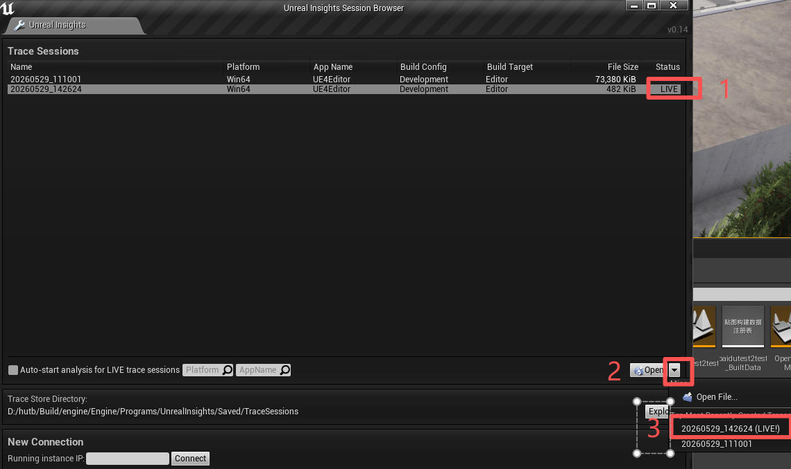
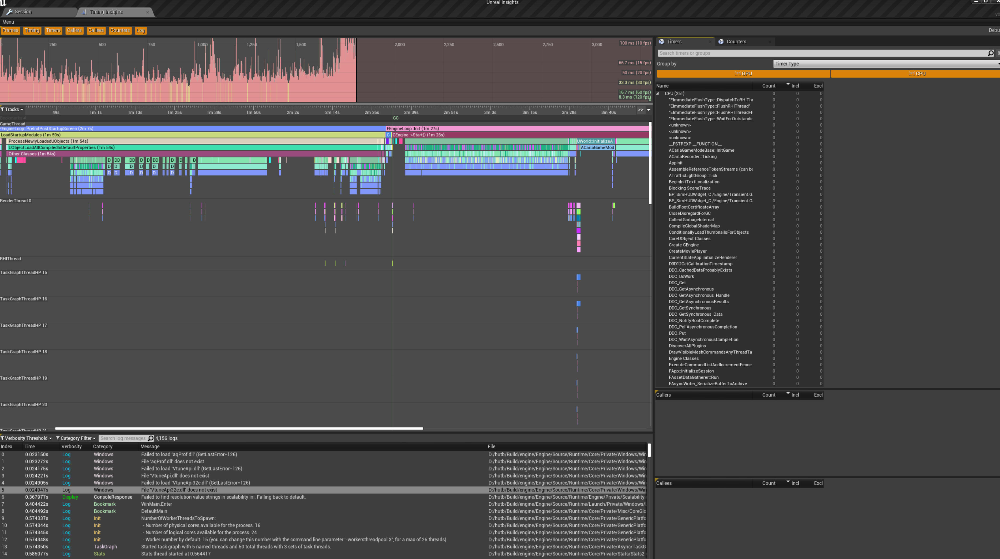
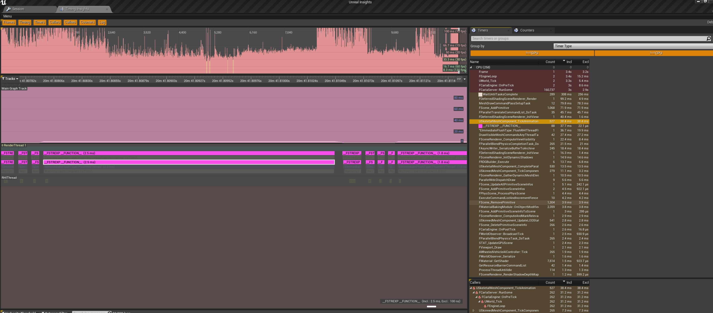

# 内存优化

## Insights

1.运行 hutb\Build\engine\Engine\Binaries\Win64\UnrealInsights.exe,不会弹出界面，任务管理器中有后台进程；

2.在虚幻编辑器中`执行独立进程游戏`或者打包的exe；

这时会发现Insights自动创建并开始运行了一个Trace Sessions，持续记录到 hutb\Build\engine\Engine\Programs\UnrealInsights\Saved\TraceSessions\*.utrace 文件中（也可以通过连接IP地址，获取到该计算机的UE程序，状态为LIVE实时）；



3.点击右下角 Open 按钮，弹出UnrealInsights窗口。如果发现没有持续trace，就使用trace.start命令



点突然变很高的柱，对应下方就是这一个横条最宽，这里就是问题所在。滑动鼠标滚轮放大下面的横条，可以看到具体的函数。

内存溢出后的崩溃日志位于：hutb\Unreal\CarlaUE4\Saved\Logs\*.log


内存移除时的调用栈：


发现一直在执行`__FSTREXP __FUNCTION__`，调用它的函数为：`USkeletalMeshComponent_TickAnimation`，猜测一直在新建`Bus-1`的骨骼网格组件。因为Town03 有 265 个生成点，冒烟测试时会一次性生成265台车。

正常编辑器进程只占用 12-14 GB，崩溃时占用 33 GB。

BYD_SONG 静态资产大小为 393 MB（正常的 AudiA2 比如只有11MB），256个就是 100 GB。

测试：
```shell
python ..\examples\generate_traffic.py -p 3654 -n 10 --filterv vehicle.bydsong-1.bydsong-1
```


## 参考

* [骨骼网格体LOD](https://dev.epicgames.com/documentation/unreal-engine/skeletal-mesh-lods-in-unreal-engine?lang=zh-CN)

* [UE 性能分析：内存优化](https://imzlp.com/posts/19135/)


```text
(hutb) D:\hutb\PythonAPI\test>python -m nose2 -v smoke.test_spawnpoints.TestSpawnpoints
test_spawn_points (smoke.test_spawnpoints.TestSpawnpoints) ... INFO:  Found the required file in cache!  Carla/Maps/Nav/Town03.bin
TestSpawnpoints.test_spawn_points
INFO:  Found the required file in cache!  Carla/Maps/Nav/Town03.bin
Testing spawn points for ActorBlueprint(id=vehicle.bydsong-1.bydsong-1,tags=[vehicle, bydsong-1]) in Town03 with 265 spawn points
Testing spawn points for ActorBlueprint(id=vehicle.mini-3.mini-3,tags=[vehicle, mini-3]) in Town03 with 265 spawn points
Testing spawn points for ActorBlueprint(id=vehicle.byd.seal,tags=[vehicle, byd, seal]) in Town03 with 265 spawn points
Testing spawn points for ActorBlueprint(id=vehicle.kawasaki.ninja,tags=[vehicle, kawasaki, ninja]) in Town03 with 265 spawn points
Testing spawn points for ActorBlueprint(id=vehicle.audi.a2,tags=[vehicle, audi, a2]) in Town03 with 265 spawn points
Testing spawn points for ActorBlueprint(id=vehicle.nissan.micra,tags=[vehicle, nissan, micra]) in Town03 with 265 spawn points
Testing spawn points for ActorBlueprint(id=vehicle.su7.su7,tags=[vehicle, su7]) in Town03 with 265 spawn points
Testing spawn points for ActorBlueprint(id=vehicle.audi.tt,tags=[vehicle, audi, tt]) in Town03 with 265 spawn points
Testing spawn points for ActorBlueprint(id=vehicle.mercedes.coupe_2020,tags=[vehicle, mercedes, coupe_2020]) in Town03 with 265 spawn points
Testing spawn points for ActorBlueprint(id=vehicle.bmw.grandtourer,tags=[vehicle, bmw, grandtourer]) in Town03 with 265 spawn points
Testing spawn points for ActorBlueprint(id=vehicle.harley-davidson.low_rider,tags=[vehicle, harley-davidson, low_rider]) in Town03 with 265 spawn points
Testing spawn points for ActorBlueprint(id=vehicle.ford.ambulance,tags=[vehicle, ford, ambulance]) in Town03 with 265 spawn points
Testing spawn points for ActorBlueprint(id=vehicle.micro.microlino,tags=[vehicle, micro, microlino]) in Town03 with 265 spawn points
Testing spawn points for ActorBlueprint(id=vehicle.carlamotors.carlacola,tags=[vehicle, carlamotors, carlacola]) in Town03 with 265 spawn points
Testing spawn points for ActorBlueprint(id=vehicle.ford.mustang,tags=[vehicle, ford, mustang]) in Town03 with 265 spawn points
Testing spawn points for ActorBlueprint(id=vehicle.chevrolet.impala,tags=[vehicle, chevrolet, impala]) in Town03 with 265 spawn points
Testing spawn points for ActorBlueprint(id=vehicle.lincoln.mkz_2020,tags=[vehicle, lincoln, mkz_2020]) in Town03 with 265 spawn points
Testing spawn points for ActorBlueprint(id=vehicle.lixiang-1.lixiang-1,tags=[vehicle, lixiang-1]) in Town03 with 265 spawn points
Testing spawn points for ActorBlueprint(id=vehicle.citroen.c3,tags=[vehicle, citroen, c3]) in Town03 with 265 spawn points
Testing spawn points for ActorBlueprint(id=vehicle.dodge.charger_police,tags=[vehicle, dodge, charger_police]) in Town03 with 265 spawn points
Testing spawn points for ActorBlueprint(id=vehicle.nissan.patrol,tags=[vehicle, nissan, patrol]) in Town03 with 265 spawn points
Testing spawn points for ActorBlueprint(id=vehicle.jeep.wrangler_rubicon,tags=[vehicle, jeep, wrangler_rubicon]) in Town03 with 265 spawn points
Testing spawn points for ActorBlueprint(id=vehicle.mini.cooper_s,tags=[vehicle, mini, cooper_s]) in Town03 with 265 spawn points
Testing spawn points for ActorBlueprint(id=vehicle.mercedes.coupe,tags=[vehicle, mercedes, coupe]) in Town03 with 265 spawn points
Testing spawn points for ActorBlueprint(id=vehicle.dodge.charger_2020,tags=[vehicle, dodge, charger_2020]) in Town03 with 265 spawn points
Testing spawn points for ActorBlueprint(id=vehicle.ford.crown,tags=[vehicle, ford, crown]) in Town03 with 265 spawn points
Testing spawn points for ActorBlueprint(id=vehicle.seat.leon,tags=[vehicle, seat, leon]) in Town03 with 265 spawn points
Testing spawn points for ActorBlueprint(id=vehicle.toyota.prius,tags=[vehicle, toyota, prius]) in Town03 with 265 spawn points
Testing spawn points for ActorBlueprint(id=vehicle.yamaha.yzf,tags=[vehicle, yamaha, yzf]) in Town03 with 265 spawn points
Testing spawn points for ActorBlueprint(id=vehicle.xiaopeng-1.xiaopeng-1,tags=[vehicle, xiaopeng-1]) in Town03 with 265 spawn points
Testing spawn points for ActorBlueprint(id=vehicle.bh.crossbike,tags=[vehicle, bh, crossbike]) in Town03 with 265 spawn points
Testing spawn points for ActorBlueprint(id=vehicle.tesla.model3,tags=[vehicle, tesla, model3]) in Town03 with 265 spawn points
Testing spawn points for ActorBlueprint(id=vehicle.gazelle.omafiets,tags=[vehicle, gazelle, omafiets]) in Town03 with 265 spawn points
Testing spawn points for ActorBlueprint(id=vehicle.tesla.cybertruck,tags=[vehicle, tesla, cybertruck]) in Town03 with 265 spawn points
Testing spawn points for ActorBlueprint(id=vehicle.diamondback.century,tags=[vehicle, century, diamondback]) in Town03 with 265 spawn points
Testing spawn points for ActorBlueprint(id=vehicle.mercedes.sprinter,tags=[vehicle, mercedes, sprinter]) in Town03 with 265 spawn points
Testing spawn points for ActorBlueprint(id=vehicle.audi.etron,tags=[vehicle, audi, etron]) in Town03 with 265 spawn points
Testing spawn points for ActorBlueprint(id=vehicle.volkswagen.t2,tags=[vehicle, volkswagen, t2]) in Town03 with 265 spawn points
Testing spawn points for ActorBlueprint(id=vehicle.lincoln.mkz_2017,tags=[vehicle, lincoln, mkz_2017]) in Town03 with 265 spawn points
Testing spawn points for ActorBlueprint(id=vehicle.dodge.charger_police_2020,tags=[vehicle, dodge, charger_police_2020]) in Town03 with 265 spawn points
Testing spawn points for ActorBlueprint(id=vehicle.vespa.zx125,tags=[vehicle, zx125, vespa]) in Town03 with 265 spawn points
Testing spawn points for ActorBlueprint(id=vehicle.mini.cooper_s_2021,tags=[vehicle, mini, cooper_s_2021]) in Town03 with 265 spawn points
Testing spawn points for ActorBlueprint(id=vehicle.nissan.patrol_2021,tags=[vehicle, patrol_2021, nissan]) in Town03 with 265 spawn points
Testing spawn points for ActorBlueprint(id=vehicle.volkswagen.t2_2021,tags=[vehicle, t2_2021, volkswagen]) in Town03 with 265 spawn points
Testing spawn points for ActorBlueprint(id=vehicle.wj.wj,tags=[vehicle, wj]) in Town03 with 265 spawn points
Testing spawn points for ActorBlueprint(id=vehicle.hongqi-2.hongqi-2,tags=[vehicle, hongqi-2]) in Town03 with 265 spawn points
Testing spawn points for ActorBlueprint(id=vehicle.byd_bus.byd_bus,tags=[vehicle, byd_bus]) in Town03 with 265 spawn points
Testing spawn points for ActorBlueprint(id=vehicle.bus-1.bus-1,tags=[vehicle, bus-1]) in Town03 with 265 spawn points
FAIL
ERROR

======================================================================
ERROR: test_spawn_points (smoke.test_spawnpoints.TestSpawnpoints)
----------------------------------------------------------------------
Traceback (most recent call last):
  File "D:\hutb\PythonAPI\test\smoke\__init__.py", line 55, in tearDown
    super(SyncSmokeTest, self).tearDown()
  File "D:\hutb\PythonAPI\test\smoke\__init__.py", line 24, in tearDown
    self.client.load_world("Town03")
RuntimeError: time-out of 120000ms while waiting for the simulator, make sure the simulator is ready and connected to localhost:3654

======================================================================
FAIL: test_spawn_points (smoke.test_spawnpoints.TestSpawnpoints)
----------------------------------------------------------------------
Traceback (most recent call last):
  File "D:\hutb\PythonAPI\test\smoke\test_spawnpoints.py", line 71, in test_spawn_points
    self.assertFalse(
AssertionError: True is not false : Spawn errors detected:
  - idx=12, bp=vehicle.bus-1.bus-1, actor_id=0, loc=(-77.887,33.207,0.649), rot=(-0.35,-90.16,-0.00), error=Spawn failed because of collision at spawn position
  - idx=34, bp=vehicle.bus-1.bus-1, actor_id=0, loc=(-121.302,136.416,0.275), rot=(0.00,-0.60,0.00), error=Spawn failed because of collision at spawn position
  - idx=53, bp=vehicle.bus-1.bus-1, actor_id=0, loc=(150.919,-162.626,4.518), rot=(0.00,91.00,0.00), error=Spawn failed because of collision at spawn position
  - idx=67, bp=vehicle.bus-1.bus-1, actor_id=0, loc=(-31.326,131.243,0.275), rot=(0.00,178.70,0.00), error=Spawn failed because of collision at spawn position
  - idx=76, bp=vehicle.bus-1.bus-1, actor_id=0, loc=(154.558,-166.591,3.788), rot=(-2.32,-89.00,0.00), error=Spawn failed because of collision at spawn position
  - idx=118, bp=vehicle.bus-1.bus-1, actor_id=0, loc=(1.673,79.557,0.275), rot=(0.00,-88.89,0.00), error=Spawn failed because of collision at spawn position
  - idx=157, bp=vehicle.bus-1.bus-1, actor_id=0, loc=(-59.361,135.467,0.275), rot=(0.00,-1.30,0.00), error=Spawn failed because of collision at spawn position
  - idx=177, bp=vehicle.bus-1.bus-1, actor_id=0, loc=(2.295,176.878,0.275), rot=(0.00,-90.36,0.00), error=Spawn failed because of collision at spawn position
  - idx=201, bp=vehicle.bus-1.bus-1, actor_id=0, loc=(107.897,62.557,0.275), rot=(0.00,-0.15,0.00), error=Spawn failed because of collision at spawn position
  - idx=202, bp=vehicle.bus-1.bus-1, actor_id=0, loc=(-9.262,155.709,0.275), rot=(0.00,89.64,0.00), error=Spawn failed because of collision at spawn position
  - idx=203, bp=vehicle.bus-1.bus-1, actor_id=0, loc=(-5.762,161.587,0.275), rot=(0.00,89.64,0.00), error=Spawn failed because of collision at spawn position
  - idx=216, bp=vehicle.bus-1.bus-1, actor_id=0, loc=(234.770,3.551,0.275), rot=(0.00,91.39,0.00), error=Spawn failed because of collision at spawn position
  - idx=221, bp=vehicle.bus-1.bus-1, actor_id=0, loc=(4.105,-46.116,0.275), rot=(0.00,-88.59,0.00), error=Spawn failed because of collision at spawn position
  - idx=228, bp=vehicle.bus-1.bus-1, actor_id=0, loc=(-42.351,-2.835,0.275), rot=(0.00,-179.71,0.00), error=Spawn failed because of collision at spawn position
  - idx=231, bp=vehicle.bus-1.bus-1, actor_id=0, loc=(-9.018,24.411,0.275), rot=(0.00,78.62,0.00), error=Spawn failed because of collision at spawn position
  - idx=244, bp=vehicle.bus-1.bus-1, actor_id=0, loc=(37.282,3.424,0.275), rot=(0.00,-13.67,0.00), error=Spawn failed because of collision at spawn position
  - idx=245, bp=vehicle.bus-1.bus-1, actor_id=0, loc=(16.031,10.789,0.275), rot=(0.00,-58.80,0.00), error=Spawn failed because of collision at spawn position
  - idx=257, bp=vehicle.bus-1.bus-1, actor_id=0, loc=(-67.324,0.537,0.275), rot=(0.00,0.29,0.00), error=Spawn failed because of collision at spawn position

----------------------------------------------------------------------
Ran 1 test in 407.589s

FAILED (failures=1, errors=1)
```